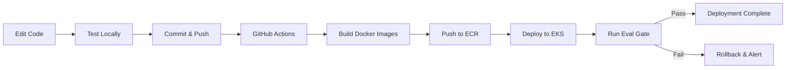

# Docker & CI/CD Architecture

## 📦 Project Structure

```
med_doc_processing/
├── backend-fastapi/           # Backend service (self-contained)
│   ├── Dockerfile            # Backend Docker build
│   ├── .dockerignore         # Ignore venv, .env, etc.
│   ├── requirements.txt      # Python dependencies
│   ├── .env                  # Backend secrets (NOT committed)
│   └── app/                  # FastAPI application
│
├── client/                   # Frontend source
│   ├── src/                  # React components
│   └── index.html
│
├── shared/                   # Shared TypeScript types
│   └── schema.ts
│
├── Dockerfile.frontend       # Frontend Docker build (at root)
├── docker-compose.yml        # Local development orchestration
├── .dockerignore             # Root-level ignore (for frontend build)
├── package.json              # Root package.json (has frontend scripts)
├── vite.config.ts            # Vite config (references client/)
└── .github/
    └── workflows/
        └── ci-cd.yml         # GitHub Actions CI/CD pipeline
```

## 🏗️ Why This Architecture?

### Backend (`backend-fastapi/`)
- **Self-contained**: Dockerfile, requirements.txt, .env all in one folder
- **Build context**: `./backend-fastapi`
- **CI/CD**: Builds independently from its own folder

### Frontend (repo root)
- **Monorepo style**: Uses root `package.json`, `vite.config.ts`, references `client/` and `shared/`
- **Build context**: `.` (repo root)
- **Dockerfile**: `Dockerfile.frontend` at root (needs access to all configs)
- **CI/CD**: Builds from root with `-f Dockerfile.frontend`

## 🐳 Docker Compose

### Local Development

```bash
# Start both services
docker compose up --build

# Backend: http://localhost:8000
# Frontend: http://localhost:5173
# Frontend calls backend at: http://backend:8000 (container name)
```

### Key Features

1. **Backend healthcheck**: Frontend waits for backend to be ready
2. **Persistent database**: SQLite data persists in `backend-data` volume
3. **Environment variables**: Backend loads from `backend-fastapi/.env`
4. **Build args**: Frontend accepts `VITE_API_BASE_URL` at build time
5. **Container networking**: Frontend calls backend via service name `backend:8000`

## 🚀 CI/CD Pipeline

### GitHub Actions Workflow (`.github/workflows/ci-cd.yml`)

**Triggers:**
- Push to `main` or `develop` → Build & deploy
- Pull requests → Build only (no deploy)

**Jobs:**

1. **build-backend**
   - Builds from `backend-fastapi/` folder
   - Pushes to ECR as `med-doc-backend:latest` and `med-doc-backend:<commit-sha>`
   - Independent from frontend

2. **build-frontend**
   - Builds from repo root with `-f Dockerfile.frontend`
   - Uses build arg `VITE_API_BASE_URL` from secrets
   - Pushes to ECR as `med-doc-frontend:latest` and `med-doc-frontend:<commit-sha>`

3. **deploy**
   - Updates EKS deployments with new image tags
   - Waits for rollout to complete
   - Runs evaluation gate (blocks if evals fail)

### Required GitHub Secrets

```
AWS_ACCOUNT_ID            # Your AWS account ID (12 digits)
AWS_ACCESS_KEY_ID         # IAM user access key
AWS_SECRET_ACCESS_KEY     # IAM user secret key
VITE_API_BASE_URL         # Frontend API URL (e.g., https://api.yourdomain.com)
```

## 📝 Making Changes

### Backend Changes

```bash
# 1. Edit backend code
cd backend-fastapi
# ... make changes to app/

# 2. Test locally
python -m uvicorn app.main:app --reload

# 3. Test in Docker
docker build -t med-doc-backend:test .
docker run -p 8000:8000 --env-file .env med-doc-backend:test

# 4. Commit and push
git add .
git commit -m "feat: add new endpoint"
git push origin main

# 5. CI/CD automatically:
#    - Builds new backend image
#    - Pushes to ECR
#    - Deploys to EKS
#    - Runs eval gate
```

### Frontend Changes

```bash
# 1. Edit frontend code
cd client/src
# ... make changes to components

# 2. Test locally (from repo root)
npm run frontend:dev

# 3. Test in Docker
docker build -f Dockerfile.frontend -t med-doc-frontend:test .
docker run -p 5173:80 med-doc-frontend:test

# 4. Commit and push
git add .
git commit -m "feat: improve UI"
git push origin main

# 5. CI/CD automatically:
#    - Builds new frontend image
#    - Pushes to ECR
#    - Deploys to EKS
```

### Shared Types (`shared/schema.ts`)

```bash
# 1. Edit shared types
# 2. Rebuild BOTH services (they both reference shared/)
docker compose up --build

# 3. Push changes
git push origin main

# 4. CI/CD rebuilds both services
```

## 🔄 Update Workflow



## 🛠️ Common Commands

### Local Development

```bash
# Start services
docker compose up --build

# View logs
docker compose logs -f backend
docker compose logs -f frontend

# Restart a service
docker compose restart backend

# Stop services
docker compose down

# Clean everything (including volumes)
docker compose down -v
```

### Manual Docker Builds

```bash
# Backend
cd backend-fastapi
docker build -t med-doc-backend:local .

# Frontend
docker build -f Dockerfile.frontend \
  --build-arg VITE_API_BASE_URL=http://backend:8000 \
  -t med-doc-frontend:local .
```

### Push to ECR (Manual)

```bash
# Login to ECR
aws ecr get-login-password --region ap-south-1 | \
  docker login --username AWS --password-stdin \
  $(aws sts get-caller-identity --query Account --output text).dkr.ecr.ap-south-1.amazonaws.com

# Tag and push backend
docker tag med-doc-backend:local \
  123456789.dkr.ecr.ap-south-1.amazonaws.com/med-doc-backend:latest
docker push 123456789.dkr.ecr.ap-south-1.amazonaws.com/med-doc-backend:latest

# Tag and push frontend
docker tag med-doc-frontend:local \
  123456789.dkr.ecr.ap-south-1.amazonaws.com/med-doc-frontend:latest
docker push 123456789.dkr.ecr.ap-south-1.amazonaws.com/med-doc-frontend:latest
```

## 🔍 Debugging

### Backend won't start

```bash
# Check logs
docker compose logs backend

# Common issues:
# - Missing .env file → Create backend-fastapi/.env
# - Wrong Python version → Use Python 3.12
# - Anthropic SDK error → Pin anthropic==0.40.0, httpx==0.27.2
```

### Frontend won't build

```bash
# Check logs
docker compose logs frontend

# Common issues:
# - Missing node_modules → Run npm install locally first
# - Vite config error → Check vite.config.ts paths
# - Build arg missing → Set VITE_API_BASE_URL
```

### Frontend can't reach backend

```bash
# Check VITE_API_BASE_URL in docker-compose.yml
# Should be: http://backend:8000 (container name)

# In production (K8s), use:
# - Internal service: http://api (within cluster)
# - External: https://api.yourdomain.com
```

## 📊 Environment Variables

### Backend (`.env` file)

```env
USE_CLAUDE_REAL=true
CLAUDE_MODEL=claude-3-5-sonnet-20241022
ANTHROPIC_API_KEY=sk-ant-api03-...
DB_URL=sqlite:////data/app.db
ALLOW_ORIGINS=http://localhost:5173,http://backend:8000
AWS_REGION=ap-south-1
S3_BUCKET=med-docs-dev
```

### Frontend (build-time ARG)

```dockerfile
ARG VITE_API_BASE_URL=http://backend:8000
```

**Local:** `http://backend:8000` (Docker container name)  
**Production:** `https://api.yourdomain.com` (set in GitHub secrets)

## ✅ Best Practices

1. **Never commit `.env` files** (secrets)
2. **Use `.dockerignore`** to speed builds and avoid leaking secrets
3. **Pin dependency versions** (requirements.txt, package.json)
4. **Run non-root user** in containers (backend Dockerfile does this)
5. **Use multi-stage builds** (frontend Dockerfile does this)
6. **Tag images with commit SHA** (CI/CD does this)
7. **Run eval gates** before deploying to production
8. **Use health checks** in docker-compose and K8s

---

**Questions?** Check `DEPLOYMENT_ROADMAP.md` for full AWS setup guide.
