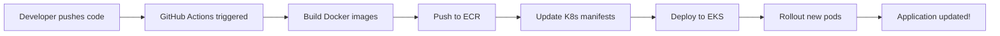

# 🚀 GitHub Actions CI/CD Setup Guide

This guide explains how to set up automated deployments using GitHub Actions.

## Prerequisites

- ✅ AWS Account with EKS cluster running
- ✅ GitHub repository with code
- ✅ AWS IAM user with necessary permissions

---

## Step 1: Configure AWS OIDC for GitHub Actions

GitHub Actions needs permission to deploy to your AWS account. We'll use OIDC (no long-lived credentials needed).

### 1.1 Create OIDC Provider in AWS

```bash
# Get your GitHub repository info
GITHUB_ORG="amberIS01"  # Your GitHub username or org
GITHUB_REPO="med_doc_processing"

# Create OIDC provider (only once per AWS account)
aws iam create-open-id-connect-provider \
  --url https://token.actions.githubusercontent.com \
  --client-id-list sts.amazonaws.com \
  --thumbprint-list 6938fd4d98bab03faadb97b34396831e3780aea1
```

### 1.2 Create IAM Role for GitHub Actions

```bash
# Create trust policy
cat > github-actions-trust-policy.json <<EOF
{
  "Version": "2012-10-17",
  "Statement": [
    {
      "Effect": "Allow",
      "Principal": {
        "Federated": "arn:aws:iam::503837496832:oidc-provider/token.actions.githubusercontent.com"
      },
      "Action": "sts:AssumeRoleWithWebIdentity",
      "Condition": {
        "StringEquals": {
          "token.actions.githubusercontent.com:aud": "sts.amazonaws.com"
        },
        "StringLike": {
          "token.actions.githubusercontent.com:sub": "repo:${GITHUB_ORG}/${GITHUB_REPO}:*"
        }
      }
    }
  ]
}
EOF

# Create the role
aws iam create-role \
  --role-name GitHubActionsDeployRole \
  --assume-role-policy-document file://github-actions-trust-policy.json \
  --description "Role for GitHub Actions to deploy to EKS"
```

### 1.3 Attach Permissions to the Role

```bash
# Create permissions policy
cat > github-actions-permissions.json <<EOF
{
  "Version": "2012-10-17",
  "Statement": [
    {
      "Effect": "Allow",
      "Action": [
        "ecr:GetAuthorizationToken",
        "ecr:BatchCheckLayerAvailability",
        "ecr:GetDownloadUrlForLayer",
        "ecr:BatchGetImage",
        "ecr:PutImage",
        "ecr:InitiateLayerUpload",
        "ecr:UploadLayerPart",
        "ecr:CompleteLayerUpload"
      ],
      "Resource": "*"
    },
    {
      "Effect": "Allow",
      "Action": [
        "eks:DescribeCluster",
        "eks:ListClusters"
      ],
      "Resource": "*"
    },
    {
      "Effect": "Allow",
      "Action": [
        "sts:GetCallerIdentity"
      ],
      "Resource": "*"
    }
  ]
}
EOF

# Attach the policy
aws iam put-role-policy \
  --role-name GitHubActionsDeployRole \
  --policy-name GitHubActionsDeployPolicy \
  --policy-document file://github-actions-permissions.json
```

---

## Step 2: Configure GitHub Repository Secrets

Go to your GitHub repository → **Settings** → **Secrets and variables** → **Actions** → **New repository secret**

Add the following secrets:

| Secret Name | Value | Description |
|-------------|-------|-------------|
| `AWS_ROLE_ARN` | `arn:aws:iam::503837496832:role/GitHubActionsDeployRole` | IAM role for GitHub Actions |
| `AWS_REGION` | `ap-south-1` | AWS region |
| `EKS_CLUSTER_NAME` | `med-doc-dev` | EKS cluster name |
| `ANTHROPIC_API_KEY` | `sk-ant-api03-...` | Claude API key |

---

## Step 3: Review the Workflow File

The workflow file is already created at `.github/workflows/ci-cd.yml`. It will:

1. ✅ Trigger on push to `main` branch
2. ✅ Build Docker images for backend and frontend
3. ✅ Push images to Amazon ECR
4. ✅ Deploy to EKS cluster using `kubectl`

---

## Step 4: Test the CI/CD Pipeline

### 4.1 Make a Code Change

```bash
# Make any small change (e.g., update README)
echo "# Test CI/CD" >> README.md
git add README.md
git commit -m "Test: Trigger CI/CD pipeline"
git push origin main
```

### 4.2 Monitor the Workflow

1. Go to GitHub repository → **Actions** tab
2. You should see a new workflow run starting
3. Click on it to see real-time logs

### 4.3 Verify Deployment

```bash
# Check if pods are updated
kubectl -n dev get pods

# Check if new images are deployed
kubectl -n dev describe pod <pod-name> | grep Image:

# Get LoadBalancer URL
kubectl -n dev get svc web
```

---

## Step 5: How It Works



### Workflow Steps:

1. **Checkout code**: Get latest code from GitHub
2. **Configure AWS credentials**: Use OIDC to assume IAM role
3. **Login to ECR**: Authenticate Docker to push images
4. **Build backend**: Create Docker image for FastAPI backend
5. **Build frontend**: Create Docker image for React frontend
6. **Push images**: Upload to ECR with `latest` tag
7. **Update kubeconfig**: Configure kubectl for EKS cluster
8. **Deploy**: Apply Kubernetes manifests
9. **Rollout restart**: Force pods to pull new images

---

## Troubleshooting

### Issue: "Error: Credentials could not be loaded"

**Solution**: Make sure OIDC provider and IAM role are created correctly.

```bash
# Verify OIDC provider exists
aws iam list-open-id-connect-providers

# Verify role exists
aws iam get-role --role-name GitHubActionsDeployRole
```

### Issue: "Error: failed to push to ECR"

**Solution**: Check ECR permissions in IAM role policy.

```bash
# Test ECR login manually
aws ecr get-login-password --region ap-south-1 | docker login --username AWS --password-stdin 503837496832.dkr.ecr.ap-south-1.amazonaws.com
```

### Issue: "Error: kubectl command not found"

**Solution**: The workflow installs kubectl automatically. Check the setup-kubectl step logs.

### Issue: "Pods not updating after deployment"

**Solution**: Check image pull policy and image tags.

```bash
# Force rollout restart
kubectl -n dev rollout restart deployment/api
kubectl -n dev rollout restart deployment/web

# Check image being used
kubectl -n dev get pods -o jsonpath='{.items[*].spec.containers[*].image}'
```

---

## Best Practices

### 1. Use Semantic Versioning for Images

Instead of `latest`, use commit SHAs or version tags:

```yaml
# In workflow
docker tag med-doc-backend:latest $ECR_BACKEND:${{ github.sha }}
docker tag med-doc-backend:latest $ECR_BACKEND:v1.0.0
```

### 2. Enable Branch Protection

- Go to **Settings** → **Branches** → **Add rule**
- Require pull request reviews before merging
- Require status checks (CI tests) to pass

### 3. Add Health Checks

Make sure `/health` endpoint always responds:

```python
@router.get("/health")
async def health_check():
    return {"status": "healthy", "timestamp": datetime.utcnow().isoformat()}
```

### 4. Monitor Deployments

```bash
# Watch rollout progress
kubectl -n dev rollout status deployment/api --watch

# View logs
kubectl -n dev logs -f deployment/api

# Check events
kubectl -n dev get events --sort-by='.lastTimestamp'
```

---

## Security Checklist

- ✅ Never commit AWS credentials to Git
- ✅ Use OIDC instead of long-lived access keys
- ✅ Store sensitive data in GitHub Secrets
- ✅ Use Kubernetes Secrets for API keys
- ✅ Enable encryption for S3 buckets
- ✅ Restrict IAM roles with least-privilege policies
- ✅ Enable MFA for AWS root account
- ✅ Review GitHub Actions logs (don't print secrets)

---

## What's Next?

1. **Add automated tests** before deployment
2. **Set up staging environment** for testing
3. **Enable HTTPS** with custom domain (Route53 + ACM)
4. **Add monitoring** (CloudWatch, Prometheus)
5. **Implement blue-green deployments** for zero-downtime

---

## Quick Reference

### Manual Deployment (Fallback)

```powershell
# Run the deployment script
.\deploy-aws.ps1
```

### GitHub Actions Manual Trigger

Go to **Actions** → **CI/CD Pipeline** → **Run workflow** → **Run workflow**

### View Application Logs

```bash
# API logs
kubectl -n dev logs -f deployment/api --tail=100

# Frontend logs
kubectl -n dev logs -f deployment/web --tail=100
```

### Scale Deployments

```bash
# Scale up
kubectl -n dev scale deployment/api --replicas=4

# Scale down
kubectl -n dev scale deployment/api --replicas=1
```

---

🎉 **You're all set!** Every push to `main` will now automatically deploy to your EKS cluster.
